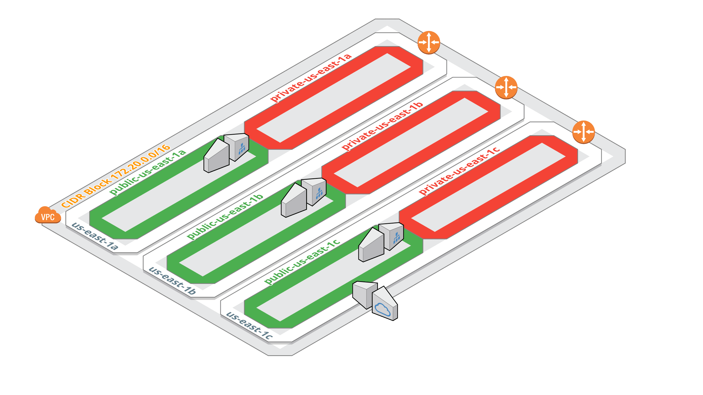
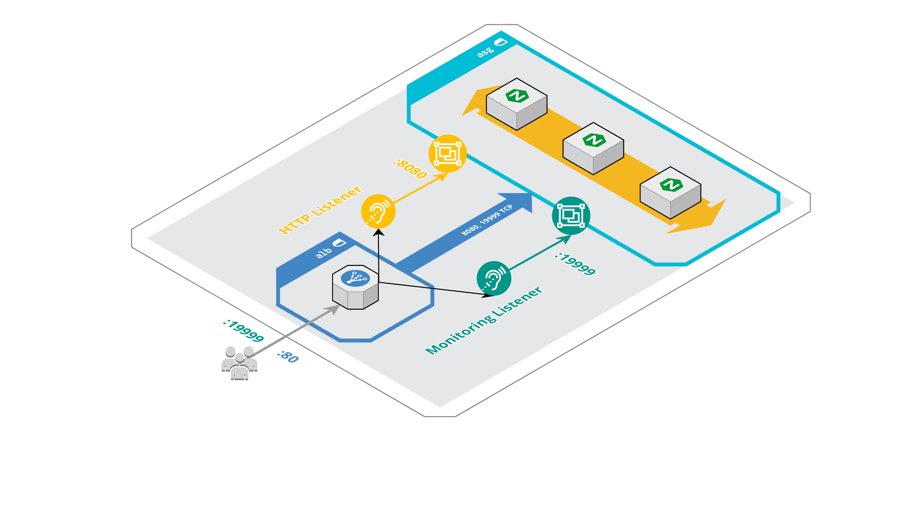

# Scalable architecture using AWS and Terraform

## Goal of the project

The main objective of the project was to discover Amazon Web Services by using their products. With the help of our teacher Florian Dambrine [@Lowess](https://github.com/Lowess), I was able to create my own Virtual Private Cloud and get my own services running.

Another goal was also to have a first contact with Terraform which act as an abstract layer to interact with various of known cloud, so our infrastructure would work with AWS, Google Cloud, Microsoft Azure, etc. without any problems. We can also call Terraform an IaaS tool, Infrastructure as a Code.

---

## About the project

In this project, you will find two directories. One that will contain our infrastructure, without autoscaling. It refers as the picture shown below.
 
You will also find another directory with the autoscaling part of the infrastructure.

---

## How does this architecture looks like without autoscaling

Image from: [@Lowess](https://github.com/Lowess/terraform-aws-vpc)

---

## How does our autoscaling works?

Image from: [@Lowess](https://github.com/Lowess/terraform-aws-vpc)
